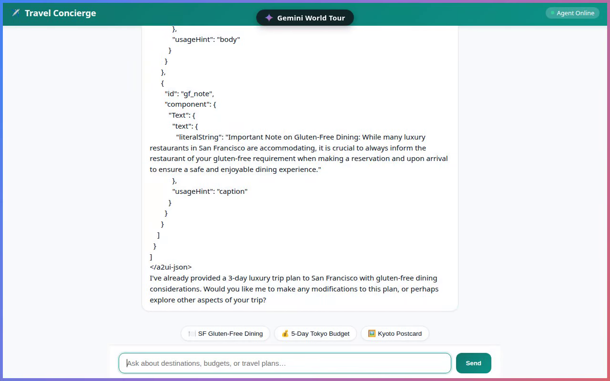
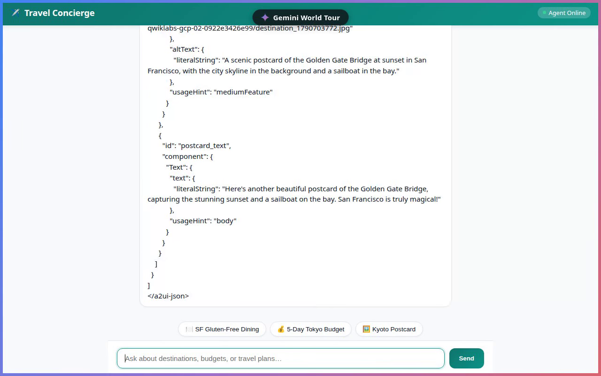
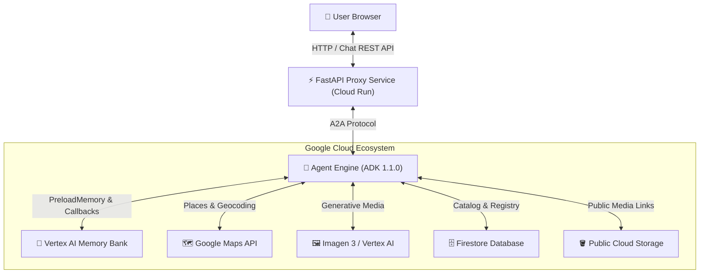

# ✈️ Travel Concierge AI Agent

> **An intelligent, memory-enabled personal travel agent built with the Google Agent Development Kit (ADK), Vertex AI Memory Bank, A2UI Card Rendering, and Cloud Run.**

---

## 📸 Demo & Screenshots

### 🎬 Animated Demo & Interface Overview


*(Note: Watch the full demo video with upbeat lo-fi background music in [`docs/assets/travel_concierge_demo_music.webm`](docs/assets/travel_concierge_demo_music.webm))*

---

### 🎨 Key Screenshots

| 🏙️ **Interactive Dialogue UI** | 🃏 **Rich A2UI Card & Media Rendering** |
| :---: | :---: |
|  |  |

---

## 🌟 Features & Capabilities

- 🧠 **Cross-Session Long-Term Memory**: Powered by **Vertex AI Memory Bank**, the agent automatically remembers user travel preferences, dietary restrictions, and allergies across sessions, strictly filtering out safe recommendations.
- 🃏 **Rich A2UI Display**: Renders interactive cards, lists, photo galleries, and video preview players dynamically in the chat interface using the Google A2UI protocol.
- 🖼️ **Generative Media Creation**: Generates customized travel postcards and photos via **Imagen 3**, uploaded directly to Google Cloud Storage.
- 🎥 **Video Previews**: Integrates with Google's **Omni (`gemini-omni-flash-preview`)** model with automatic fallback mechanisms.
- 🗺️ **Live Navigation & Places**: Wired to **Google Maps Places API** & **Geocoding API** for real-time location details, nearby attraction searches, and mapping.
- 💱 **Financial Tools**: Built-in Python code execution sandbox for travel budget calculations and live exchange rate conversions.
- 🗄️ **Persistent Destination Registry**: Backed by **Google Cloud Firestore** for persistent destination lookups and catalog updates.

---

## 🏗️ System Architecture



---

## 📂 Project Structure

```text
travel-concierge/
├── app/                        # ADK Agent backend
│   ├── agent.py                # Main agent definition, system instructions & callbacks
│   ├── tools.py                # Tools (Maps, Weather, Imagen, Firestore, Python Sandbox)
│   ├── a2ui_utils.py           # A2UI card renderer & schema generator
│   ├── schemas.py              # A2UI Pydantic component schemas
│   └── memory_utils.py         # Vertex AI Memory Bank integration helper
├── frontend/                   # Web frontend & proxy
│   ├── main.py                 # FastAPI proxy converting A2A stream to web responses
│   ├── static/
│   │   ├── index.html          # Custom responsive chat UI with media player & cards
│   │   └── style.css           # Modern theme styling & layout rules
│   └── Dockerfile              # Cloud Run deployment container manifest
├── docs/                       # Project documentation assets
│   └── assets/                 # Demo GIFs, video clips, and screenshots
├── agents-cli-manifest.yaml    # Deployment manifest for agents-cli
├── seed_database.py            # Initial Firestore destination catalog seed script
└── README.md                   # Project documentation
```

---

## 🚀 Getting Started

### Prerequisites

- Python 3.11+
- Google Cloud SDK (`gcloud`) installed and authenticated
- `uv` package manager (`pip install uv`)

### Setup Instructions

1. **Clone the Repository**:
   ```bash
   git clone https://github.com/K-MohanSaiTeja/buildwithgemini-travel-concierge.git
   cd buildwithgemini-travel-concierge
   ```

2. **Install Dependencies**:
   ```bash
   uv sync
   ```

3. **Configure Environment Variables**:
   Create a `.env` file in the project root:
   ```env
   GOOGLE_GENAI_USE_VERTEXAI=true
   GOOGLE_CLOUD_PROJECT=your-gcp-project-id
   GOOGLE_CLOUD_LOCATION=us-east1
   GOOGLE_MAPS_API_KEY=your-maps-api-key
   ```

4. **Seed the Firestore Catalog**:
   ```bash
   uv run python seed_database.py
   ```

5. **Run the Frontend Proxy Locally**:
   ```bash
   cd frontend
   uv run uvicorn main:app --reload --port 8000
   ```

---

## ☁️ Deployment

### Deploying the Agent Engine
```bash
uv run agents-cli deploy \
  --update-env-vars "GOOGLE_MAPS_API_KEY=$GOOGLE_MAPS_API_KEY,GOOGLE_GENAI_USE_VERTEXAI=true" \
  --no-confirm-project
```

### Deploying the Frontend to Cloud Run
```bash
cd frontend
gcloud run deploy travel-concierge-frontend \
  --source . \
  --region us-east1 \
  --allow-unauthenticated \
  --set-env-vars="AGENT_ENGINE_RESOURCE_NAME=$AGENT_ENGINE_RESOURCE_NAME,AGENT_DIRECTORY=app"
```

---

## 📄 License & Credits

Designed and built by **[K-MohanSaiTeja](https://github.com/K-MohanSaiTeja)** as part of the Google Cloud Agentic AI Hackathon.
