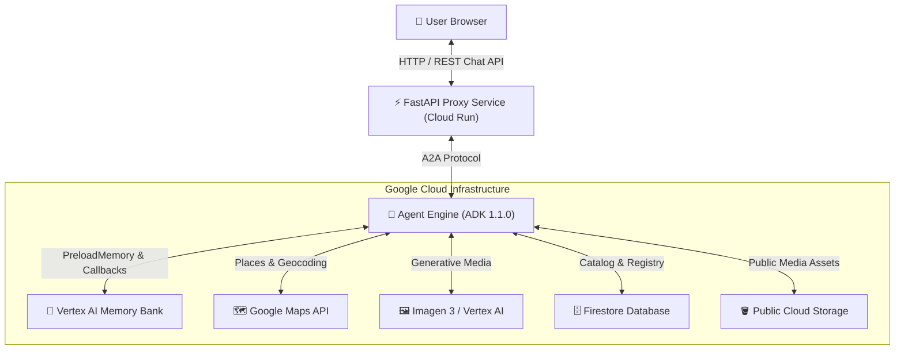

# ✈️ Travel Concierge AI Agent

> **An intelligent, memory-enabled personal travel agent built with the Google Agent Development Kit (ADK), Vertex AI Memory Bank, A2UI Card Rendering, and Cloud Run.**

[](https://github.com/K-MohanSaiTeja/buildwithgemini-travel-concierge)
[](https://travel-concierge-frontend-1043598016361.us-east1.run.app)

---

## 🎬 Live Demo & Media

### 📽️ Animated Interactive Demo


> 🔊 **Full HD Video with Background Music**:  
> Watch the video recording with custom **Vertex AI Lyria (`lyria-002`)** instrumental background music in [`docs/assets/new_agent_demo_music.webm`](docs/assets/new_agent_demo_music.webm).

---

## 📸 Interface & Media Screenshots

| 🏙️ **Interactive Dialogue UI** | 🃏 **Rich A2UI Card & Media Rendering** |
| :---: | :---: |
|  |  |

---

## 📖 Local User Guide

For detailed step-by-step instructions on setting up and running this agent on your personal laptop, check out our **[Local User Guide](docs/LOCAL_USER_GUIDE.md)**.

---

## 🌟 Key Features

- 🧠 **Cross-Session Long-Term Memory**: Powered by **Vertex AI Memory Bank**, remembering dietary preferences, budget constraints, and favorite locations across sessions.
- 🃏 **Rich A2UI Display**: Renders interactive cards, structured lists, photo galleries, and HTML5 video players using Google A2UI v0.8.
- 🖼️ **Generative Media Tools**: Generates customized travel postcards via **Imagen 3**, uploaded directly to Google Cloud Storage.
- 🎥 **Video Generation**: Integrated video creation tools with automatic image fallback.
- 🗺️ **Live Navigation & Places**: Wired to **Google Maps Places API** & **Geocoding API** for real-time attraction lookups and mapping.
- 💱 **Financial Sandbox**: Secure Python code execution for currency conversions and travel budget calculations.

---

## 🏗️ System Architecture



---

## 🚀 Quick Start (Local Laptop)

```bash
# 1. Clone repository
git clone https://github.com/K-MohanSaiTeja/buildwithgemini-travel-concierge.git
cd buildwithgemini-travel-concierge

# 2. Install dependencies
uv sync

# 3. Start backend & frontend
uv run adk web app &
cd frontend && uv run uvicorn main:app --reload --port 8080
```

Read the complete guide in **[`docs/LOCAL_USER_GUIDE.md`](docs/LOCAL_USER_GUIDE.md)**.
